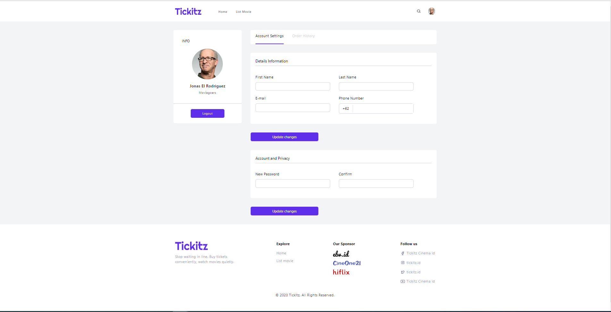
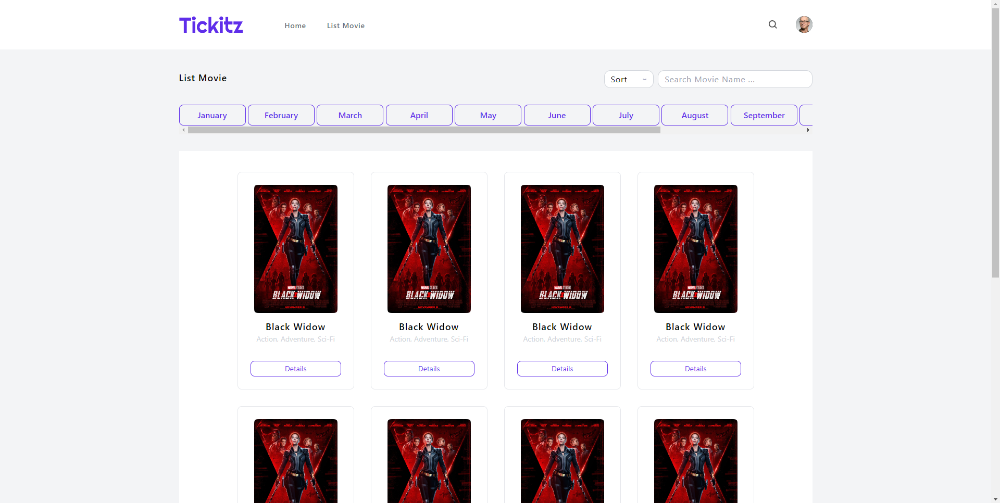
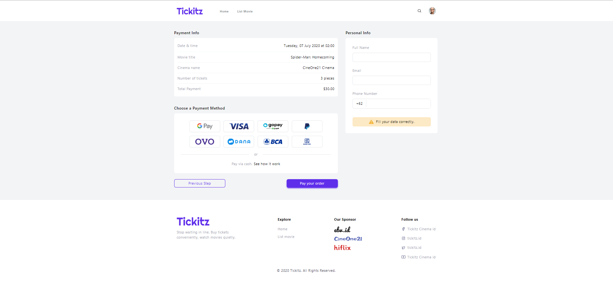
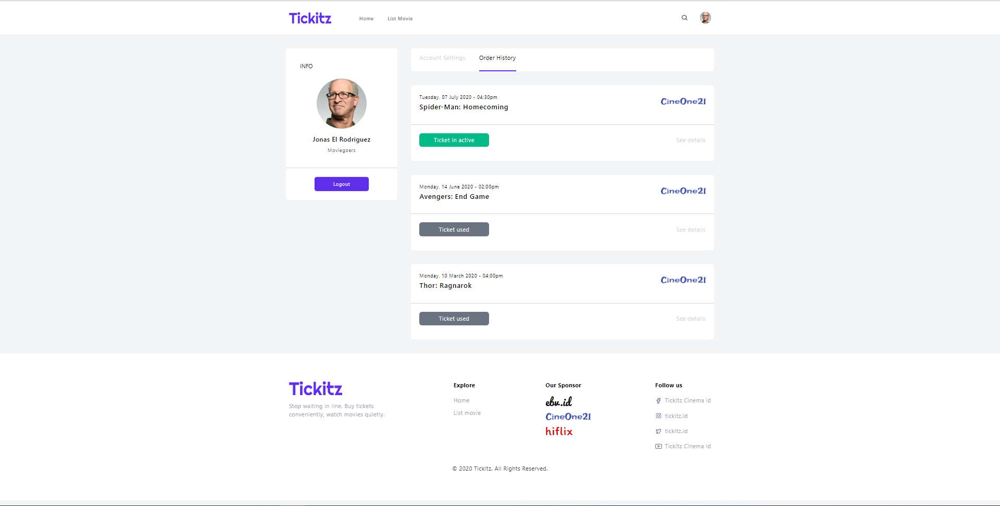

# Tickitz-Frontend
Tickitz is a place to buy cinema tickets.

## Getting Started

1. Clone this repo

   ```bash
   git clone https://github.com/ninja1cak/tickitz-frontend
   ```
2. Start the local server.

## Project Screenshot





